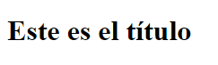
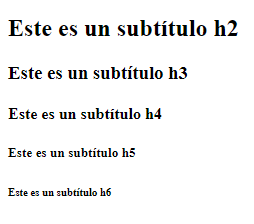

# Cabeceras:

**< h1>** Este elemento representa un título. El título se declara entre las etiquetas de apertura y cierre.

```HTML
<h1>Este es el título</h1>
```



HTML incluye elementos adicionales para representar subtítulos, hasta seis niveles:

```HTML
<h2>Este es un subtítulo</h2>
<h3>Este es un subtítulo</h3>
<h4>Este es un subtítulo</h4>
<h5>Este es un subtítulo</h5>
<h6>Este es un subtítulo</h6>
```


Cuando se visualiza en la página web, se logra ver que las letras cada vez son más pequeñas aunque estas se pueden cambiar en el CSS.

[Volver &ldca;](../README.md)
