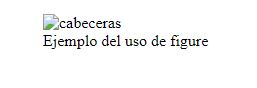

# Imágenes

**< img>** Este elemento inserta una imagen en el documento. El elemento requiere del atributo *src* para especificar la URL del archivo con la imagen que queremos incorporar. Se puede insertar la ruta del navegador o desde la web.

```HTML

```

**< picture>** Este elemento inserta una imagen en el documento. Trabaja junto con el elemento **< source>** para ofrecer múltiples imágenes en diferentes resoluciones. Es útil para crear sitios web adaptables.

**< figure>** Este elemento representa contenido asociado con el contenido principal, pero se puede eliminar sin que se vea afectado, como fotos, videos, etc.

```HTML
<figure>
    
</figure>
```

**< figcaption>** Este elemento introduce un título para el elemento **< figure>**.

```HTML
<figure>
    
        <figcaption>Cabecera para contenido</figcaption>
</figure>
```


**Alt** Atributo que especifica el texto que se muestra cuando la imagen no se puede cargar.



[Volver &ldca;](../README.md)