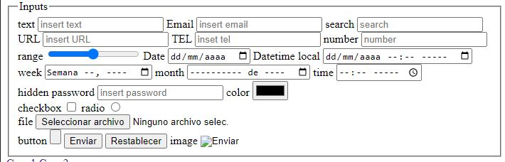

# Input

El elemento **< input>** es el más versátil de todos. Este elemento genera un campo de entrada en el que el usuario puede seleccionar o insertar información, pero puede adoptar diferentes características y aceptar varios tipos de valores dependiendo del valor de su atributo *type*.

**Text** Este valor genera un campo de entrada para insertar texto genérico.

```HTML
    <label for="text">text</label>
    <input type="text" placeholder="insert text" id="text"> 
```

**Email** Este valor genera un campo de entrada para insertar cuentas de correo.

```HTML
    <label for="email">Email</label>
    <input type="email" id="email" placeholder="insert email">
```

**Search** Este valor genera un campo de entrada para insertar términos de búsqueda.

```HTML
    <label for="search">search</label>
    <input type="search" id="search" placeholder="search">
```

**url** Este valor genera un campo de entrada para insertar URL

```HTML
    <label for="url">URL</label>
    <input type="url" id="url" placeholder="insert URL">
```

**tel** Este valor genera un campo de entrada para insertar números de teléfono.

```HTML
    <label for="tel">TEL</label>
    <input type="tel" id="tel" placeholder="inset tel">
```

**Number** Este valor genera un campo de entrada para insertar números.

```HTML
    <label for="number">number</label>
    <input type="number" id="number" placeholder="number">
```

**Range** Este valor genera un campo de entrada para insertar un rango de números.

```HTML
    <label for="range">range</label>
    <input type="range" id="range">
```

**Date** Este valor genera un campo de entrada para insertar una fecha

```HTML
    <label for="date">Date</label>
    <input type="date" id="date">
```

**datetime-local** Este valor genera un campo de entrada para insertar fecha y hora.

```HTML
    <label for="local">Datetime local</label>
    <input type="datetime-local" id="local">
```

**Week** Este valor genera un campo de entrada para insertar el número de la semana.

```HTML
    <label for="week">week</label>
    <input type="week" id="week">
```

**Month** Este valor genera un campo de entrada para insertar el número del mes.

```HTML
    <label for="month">month</label>
    <input type="month" id="month">
```

**Time** Este valor genera un campo de entrada para insertar una hora.

```HTML
    <label for="time">time</label>
    <input type="time" id="time">
```

**Hidden** Este valor oculta el campo de entrada. Se usa para enviar información complementaria al servidor.

```HTML
    <label for="">hidden</label>
    <input type="hidden" id="hidden">
```

**Password** Este valor genera un campo de entrada para insertar una clave. Reemplaza los caracteres insertados con estrellas o puntos para ocultar información sensible.

```HTML
    <label for="password">password</label>
    <input type="password" id="password" placeholder="insert password">
```

**Color** Este valor genera un campo de entrada para insertar un color.

```HTML
    <label for="color">color</label>
    <input type="color" id="color">
```

**Checkbox** Este valor genera una casilla de control que permite al usuario activar o desactivar una opción.

```HTML
    <label for="checkbox">checkbox</label>
    <input type="checkbox" id="checkbox">
```

**Radio** Este valor genera un botón de opción para seleccionar una opción de varias posibles.

```HTML
    <label for="radio">radio</label>
    <input type="radio" id="radio">
```

**File** Este valor genera un campo de entrada para seleccionar un archivo en el ordenador del usuario.

```HTML
    <label for="file">file</label>
    <input type="file" id="file">
```

**Button** Este valor genera un botón. El botón trabaja como el elemento **< button>** de tipo button. No realizada ninguna acción por defecto; la acción debe ser definida desde JavaScript.

```HTML
    <label for="button">button</label>
    <input type="button" id="button">
```

**Submit** Este valor genera un botón para enviar el formulario.

```HTML
    <input type="submit">
```

**Reset** Este valor genera un botón para reiniciar el formulario.

```HTML
    <input type="reset">
```

**Image** Este valor carga una imagen que se usa como botón para enviar el formulario. Un elemento **< input>** de este tipo debe incluir el atributo *src* para especificar la URL de la imagen.

```HTML
    <label for="image">image</label>
    <input type="image" id="image">
```

---
Para determinar cuántos caracteres se puede introducir, el elemento **< input>** debe incluirse los siguientes atributos;

**Maxlength** Este atributo especifica el máximo número de caracteres que se permite introducir en el campo.

```HTML
    <input type="text" placeholder="insert text" id="text" maxlength="10">
```

**Minlength** Este atributo especifica el mínimo número de caracteres que se permite introducir en el campo.

```HTML
    <input type="text" placeholder="insert text" id="text" minlength="8">
```

---
Para establecer restricciones en los números podemos utilizar los siguientes atributos;

**Min** El valor de este atributo determina el valor mínimo que acepta el campo.

```HTML
    <input type="number" id="number" placeholder="number" min="10">
```

**Max** El valor de este atributo determina el valor máximo que acepta el campo.

```HTML
    <input type="number" id="number" placeholder="number" max="35">
```

Step El valor de este atributo determina el número por el cual el valor del campo se puede incrementar o reducir. Por ejemplo, si declaramos el valor 5 para este atributo y un valor mínimo de 0 y máximo de 10 para el campo, el navegador no nos dejará introducir valores entre 0 y 5 o 5 y 10.

**Range** Crea un campo que nos permite seleccionar un número desde un rango de valores.



[Volver &ldca;](../README.md)